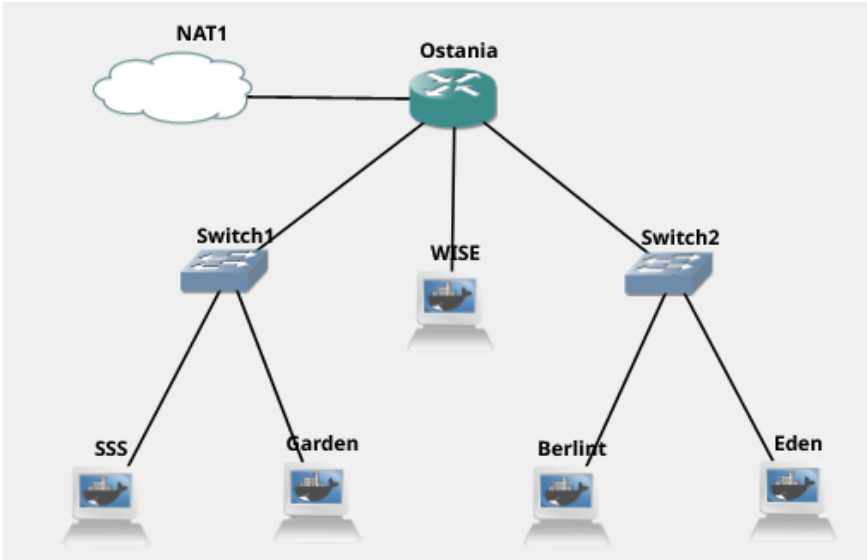

# Jarkom-Modul-2-D01-2022

### Kelompok D01

<table>
    <tr>
        <th>No</th>
        <th>Nama</th>
        <th>NRP</th>
    </tr>
    <tr>
        <td>1</td>
        <td>Ananda Hadi Saputra </td>
        <td>5025201148</td>
    </tr>
    <tr>
        <td>2</td>
        <td>Nethaneel Patricio Linggar</td>
        <td>5025201180</td>
    </tr>
    <tr>
        <td>3</td>
        <td>Yehezkiel Wiradhika</td>
        <td>5025201086</td>
    </tr>
</table>

## Pembukaan Soal

Twilight dengan nama samaran Loid Forger di bawah organisasi WISE menjalankan operasinya di negara Ostania. Berikut adalah petanya:



Deskripsi tiap soal:

<ol>
    <li>
    WISE akan menjadi DNS Master, Berlint menjadi DNS Slave, dan Eden akan digunakan sebagai Web Server. Terdapat 2 Client yaitu SSS, dan Garden. Semua node terhubung pada router Ostania, sehingga dapat mengakses internet.
    </li>
    <li>
        Buatlah website utama dengan akses wise.yyy.com dengan alias www.wise.yyy.com pada folder wise
    </li>
    <li>
        Buatlah subdomain eden.wise.yyy.com dengan alias www.eden.wise.yyy.com yang diatur DNS-nya di WISE dan mengarah ke Eden
    </li>
    <li>
        Buat reverse domain untuk domain utama
    </li>
    <li>
        Buatlah Berlint sebagai DNS Slave untuk domain utama
    </li>
    <li>
        Buat subdomain khusus untuk operation, yaitu operation.wise.yyy.com dengan alias www.operation.wise.yyy.com dengan IP menuju ke Eden dalam folder operation.
    </li>
    <li>
        Buatlah subdomain melalui Berlint dengan akses strix.operation.wise.yyy.com dengan alias www.strix.operation.wise.yyy.com yang mengarah ke Eden
    </li>
    <li>
        Lakukan konfigurasi Webserver dengan webserver www.wise.yyy.com. Buat DocumentRoot pada /var/www/wise.yyy.com
    </li>
    <li>
        buatlah agar www.wise.yyy.com/index.php/home menjadi www.wise.yyy.com/home
    </li>
    <li>
        subdomain www.eden.wise.yyy.com butuh pemyimpanan aset yang memiliki DocumentRoot pada /var/www/eden.wise.yyy.com
    </li>
    <li>
        pada folder /public, hanya dapat melakukan directory listing saja.
    </li>
    <li>
        siapkan error file 404.html pada folder /error untuk mengganti error code pada apache
    </li>
    <li>
        buatlah konfigurasi virtual host untuk dapat mengakses file aset www.eden.wise.yyy.com/public/js menjadi www.eden.wise.yyy.com/js
    </li>
    <li>
        buatlah www.strix.operation.wise.yyy.com hanya bisa diakses dengan port 15000 dan port 15500
    </li>
    <li>
        buatlah autentikasi username Twilight dan password opStrix dan file di /var/www/strix.operation.wise.yyy
    </li>
    <li>
        buatlah sehingga setiap kali mengakses IP Eden akan dialihkan secara otomatis ke www.wise.yyy.com
    </li>
    <li>
        ubahlah request gambar yang memiliki substring "eden" akan diarahkan menuju eden.png
    </li>
</ol>

## Jawaban Soal

### Soal 1

Berikut adalah topologinya:

kita lalu melakukan konfigurasi pada setiap node yang ada:
<br>
<strong>Ostania sebagai router:</strong>

```
auto eth0
iface th0 inet dhcp

auto eth1
iface eth1 inet static
    address 10.45.1.1
    netmask 255.255.255.0

auto eth2
iface eth2 inet static
    address 10.45.2.1
    netmask 255.255.255.0
```

<strong>SSS sebagai Client</strong>

```
> apt-get update
> apt-get install dnsutils
```

```
auto eth0
iface eth0 inet static
    address 10.45.1.2
    netmask 255.255.255.0
    gateway 10.45.1.1
```

<strong>Garden sebagai Client</strong>

```
auto eth0
iface eth0 inet static
    address 10.45.1.3
    netmask 255.255.255.0
    gateway 10.45.1.1
```

<strong>WISE sebaggai DNS Master</strong>

```
> apt-get update
> apt-get install bind9 -y
```

```
auto eth0
iface eth0 inet static
    address 10.45.2.2
    netmask 255.255.255.0
    gateway 10.45.2.1
```

<strong>Berlint sebagai DNS Slave</strong>

```
> apt-get update
> apt-get install bind9 -y
> echo "nameserver 192.168.122.1" > /etc/resolv.conf
```

```
auto eth0
iface eth0 inet static
    address 10.45.2.3
    netmask 255.255.255.0
    gateway 10.45.2.1
```

<strong>eden Sebagai Webserver</strong>

```
auto eth0
iface eth0 inet static
    address 10.45.2.4
    netmask 255.255.255.0
    gateway 10.45.2.1
```

setiap node kemudian diaktifkan dengan click tombol start. lalu kitamenjalankan command
<code>iptables -t nat -A POSTROUTING -o eth0 -j WISE -s 10.45.0.0/16</code> pada router Ostania sehingga dapat terkoneksi dengan internet.

### Soal 2

<strong>Server Eden</strong>
melakukan konfigurasi terhadap file <code>/etc/bind/named.conf.local </code>
dengan menambahkan

```
zone "wise.t07.com" {
        type master;
        file "/etc/bind/wise/wise.t07.com";
};
```

membuat dir baru, yakni <code>/etc/bind/wise</code>
<br><br>
menambahkan konfigurasi pada <code>/etc/bind/wise/wise.t07.com</code>

```
$TTL    604800
@       IN      SOA     wise.t07.com. root.wise.t07.com. (
                        2021100401      ; Serial
                        604800          ; Refresh
                        86400           ; Retry
                        2419200         ; Expire
                        604800 )        ; Negative Cache TTL
;
@               IN      NS      wise.t07.com.
@               IN      A       10.45.2.2 ; IP EniesLobby
www             IN      CNAME   wise.t07.com.

```

Melakukan restart service bind9 dengan <code>service bind9 restart</code>

### Soal 3

Melakukan Edit pada file <code>/etc/bind/kaizoku/wise.t07.com</code> menjadi seperti berikut:

```
$TTL    604800
@       IN      SOA     wise.t07.com. root.wise.t07.com. (
                        2021100401      ; Serial
                        604800          ; Refresh
                        86400           ; Retry
                        2419200         ; Expire
                        604800 )        ; Negative Cache TTL
;
@               IN      NS      wise.t07.com.
@               IN      A       10.45.2.2 ; IP EniesLobby
www             IN      CNAME   wise.t07.com.
super           IN      A       10.45.2.4 ; IP skype
www.super       IN      CNAME   super.wise.t07.com.
```

Melakukan restart sevice bind9 dengan <code>service bind9 restart</code>

### Soal 4

Edit file <code>/etc/bind/named.conf.local</code> menjadi sebagai berikut:

```
zone "wise.t07.com" {
        type master;
        file "/etc/bind/wise/wise.t07.com";
};

zone "2.45.10.in-addr.arpa" {
        type master;
        file "/etc/bind/wise/2.45.10.in-addr.arpa";
};
```

dan lakukan konfigurasi pada file <code>/etc/bind/wise/2.45.10.in-addr.arpa</code> seperti berikut ini:

```
$TTL    604800
@       IN      SOA     wise.t07.com. root.wise.t07.com. (
                        2021100401      ; Serial
                        604800          ; Refresh
                        86400         ; Retry
                        2419200         ; Expire
                        604800 )       ; Negative Cache TTL
;
2.45.10.in-addr.arpa.   IN      NS      wise.t07.com.
2                       IN      PTR     wise.t07.com.
```

### Soal 5

<strong>Service Berlint</strong>
<br>
lakukan konfigurasi pada file <code>/etc/bind/named.conf.local</code> sebagai berikut untuk melakukan konfigurasi DNS Slave yang mengarah ke berlint:

```
zone "wise.t07.com" {
        type master;
        notify yes;
        also-notify {10.45.2.3;};  //Masukan IP berlint tanpa tanda petik
        allow-transfer {10.45.2.3;}; // Masukan IP berlint tanpa tanda petik
        file "/etc/bind/wise/wise.t07.com";
};

zone "2.45.10.in-addr.arpa" {
        type master;
        file "/etc/bind/wise/2.45.10.in-addr.arpa";
};
```

Melakukan restart sevice bind9 dengan <code>service bind9 restart</code>

### Soal 6

Melakukan konfigurasi <code>/etc/bind/wise/wise.t07.com</code>

```
$TTL    604800
@       IN      SOA     franky.t07.com. root.franky.t07.com. (
                        2021100401      ; Serial
                        604800          ; Refresh
                        86400           ; Retry
                        2419200         ; Expire
                        604800 )        ; Negative Cache TTL
;
@               IN      NS      franky.t07.com.
@               IN      A       10.45.2.4 ; IP skypea
www             IN      CNAME   franky.t07.com.
super           IN      A       10.45.2.4 ; IP skypea
www.super       IN      CNAME   super.franky.t07.com.
ns1             IN      A       10.45.2.3; IP berlint
mecha           IN      NS      ns1
```

### Soal 7

### Soal 8

### Soal 9
