# Jarkom-Modul-2-D01-2022

### Kelompok D01

<table>
    <tr>
        <th>No</th>
        <th>Nama</th>
        <th>NRP</th>
    </tr>
    <tr>
        <td>1</td>
        <td>Ananda Hadi Saputra </td>
        <td>5025201148</td>
    </tr>
    <tr>
        <td>2</td>
        <td>Nethaneel Patricio Linggar</td>
        <td>5025201180</td>
    </tr>
    <tr>
        <td>3</td>
        <td>Yehezkiel Wiradhika</td>
        <td>5025201086</td>
    </tr>
</table>

## Pembukaan Soal

Twilight dengan nama samaran Loid Forger di bawah organisasi WISE menjalankan operasinya di negara Ostania. Berikut adalah petanya:


## List Soal

1. [Soal 1](#Soal-1)
2. [Soal 2](#Soal-2)
3. [Soal 3](#Soal-3)
4. [Soal 4](#Soal-4)
5. [Soal 5](#Soal-5)
6. [Soal 6](#Soal-6)
7. [Soal 7](#Soal-7)
8. [Soal 8](#Soal-8)
9. [Soal 9](#Soal-9)
10. [Soal 10](#Soal-10)
11. [Soal 11](#Soal-11)
12. [Soal 12](#Soal-12)
13. [Soal 13](#Soal-13)
14. [Soal 14](#Soal-14)
15. [Soal 15](#Soal-15)
16. [Soal 16](#Soal-16)
17. [Soal 17](#Soal-17)

## Jawaban Soal

### Soal 1

> WISE akan dijadikan sebagai DNS Master, Berlint akan dijadikan DNS Slave, dan Eden akan digunakan sebagai Web Server. Terdapat 2 Client yaitu SSS, dan Garden. Semua node terhubung pada router Ostania, sehingga dapat mengakses internet.

Melakukan konfigurasi dan jalankan command pada setiap node yang ada.

**Ostania sebagai router:**

Node Configuration
```
auto eth0
iface th0 inet dhcp

auto eth1
iface eth1 inet static
    address 192.185.1.1
    netmask 255.255.255.0

auto eth2
iface eth2 inet static
    address 192.185.2.1
    netmask 255.255.255.0
    
auto eth3
iface eth3 inet static
    address 192.185.3.1
    netmask 255.255.255.0
```
Command
```
> iptables -t nat -A POSTROUTING -o eth0 -j MASQUERADE -s 192.185.0.0/16
```

**SSS sebagai Client**

Node Configuration
```
auto eth0
iface eth0 inet static
    address 192.185.1.2
    netmask 255.255.255.0
    gateway 192.185.1.1
```
Command
```
> apt-get update
> apt-get install dnsutils
```

**Garden sebagai Client**

Node Configuration
```
auto eth0
iface eth0 inet static
    address 192.185.1.3
    netmask 255.255.255.0
    gateway 192.185.1.1
```
Command
```
> apt-get update
> apt-get install dnsutils
```

**WISE sebaggai DNS Master**

Node Configuration
```
auto eth0
iface eth0 inet static
    address 192.185.3.2
    netmask 255.255.255.0
    gateway 192.185.3.1
```
Command
```
> echo "nameserver 192.168.122.1" > /etc/resolv.conf
> apt-get update
> apt-get install bind9 -y
```

**Berlint sebagai DNS Slave**

Node Configuration
```
auto eth0
iface eth0 inet static
    address 192.185.3.2
    netmask 255.255.255.0
    gateway 192.185.2.1
```
Command
```
> echo "nameserver 192.168.122.1" > /etc/resolv.conf
> apt-get update
> apt-get install bind9 -y
```

**Eden Sebagai Web Server**

Node Configuration
```
auto eth0
iface eth0 inet static
    address 192.185.2.3
    netmask 255.255.255.0
    gateway 192.185.2.1
```

Command-command di atas (dan command-command yang akan kami paparkan selanjutnya) dimasukkan ke dalam <code>/root/.bashrc</code> supaya semua instalasi langsung dilaksanakan tanpa melakukannya secara manual.

### Soal 2

> Untuk mempermudah mendapatkan informasi mengenai misi dari Handler, bantulah Loid membuat website utama dengan akses wise.yyy.com dengan alias www.wise.yyy.com pada folder wise.

**Server WISE**
Melakukan konfigurasi terhadap file <code>/etc/bind/named.conf.local </code> dengan menambahkan

```
zone "wise.d01.com" {
        type master;
        file "/etc/bind/wise/wise.d01.com";
};
```

Membuat directory baru, yakni <code>/etc/bind/wise</code>, dengan <code>mkdir</code>.

Menambahkan konfigurasi pada <code>/etc/bind/wise/wise.d01.com</code>.

```
$TTL    604800
@       IN      SOA     wise.d01.com. root.wise.d01.com. (
                        2021100401      ; Serial
                        604800          ; Refresh
                        86400           ; Retry
                        2419200         ; Expire
                        604800 )        ; Negative Cache TTL
;
@               IN      NS      wise.d01.com.
@               IN      A       192.185.3.2 ; IP WISE
www             IN      CNAME   wise.d01.com.

```

Melakukan restart service bind9 dengan <code>service bind9 restart</code>

<strong>Testing</strong>

ping wise.d01.com

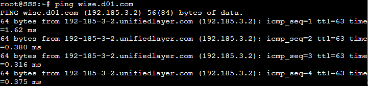

ping www.wise.d01.com

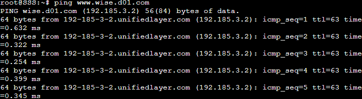

host -t CNAMAE www.wise.d01.com

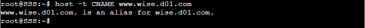


### Soal 3

> Setelah itu ia juga ingin membuat subdomain eden.wise.yyy.com dengan alias www.eden.wise.yyy.com yang diatur DNS-nya di WISE dan mengarah ke Eden

**Server WISE**
Melakukan edit pada file <code>/etc/bind/wise/wise.d01.com</code> menjadi seperti berikut:

```
$TTL    604800
@       IN      SOA     wise.d01.com. root.wise.d01.com. (
                        2021100401      ; Serial
                        604800          ; Refresh
                        86400           ; Retry
                        2419200         ; Expire
                        604800 )        ; Negative Cache TTL
;
@               IN      NS      wise.d01.com.
@               IN      A       192.185.3.2 ; IP WISE
www             IN      CNAME   wise.d01.com.
eden            IN      A       192.185.2.3 ; IP Eden
www.eden        IN      CNAME   eden.wise.d01.com.
```

Melakukan restart sevice bind9 dengan <code>service bind9 restart</code>

<strong>Testing</strong>

ping eden.wise.d01.com

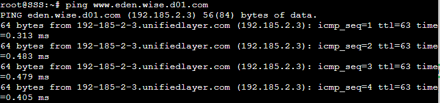

ping www.eden.wise.d01.com


host -t CNAME www.eden.wise.d01.com

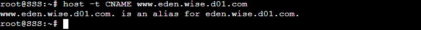

### Soal 4

> Buat juga reverse domain untuk domain utama.

**Server WISE**
Edit file <code>/etc/bind/named.conf.local</code> menjadi sebagai berikut:

```
zone "wise.d01.com" {
        type master;
        file "/etc/bind/wise/wise.d01.com";
};

zone "3.185.192.in-addr.arpa" {
        type master;
        file "/etc/bind/wise/3.185.192.in-addr.arpa";
};
```

dan lakukan konfigurasi pada file <code>/etc/bind/wise/3.185.192.in-addr.arpa</code> seperti berikut ini:

```
$TTL    604800
@       IN      SOA     wise.d01.com. root.wise.d01.com. (
                        2021100401      ; Serial
                        604800          ; Refresh
                        86400           ; Retry
                        2419200         ; Expire
                        604800 )        ; Negative Cache TTL
;
3.185.192.in-addr.arpa. IN      NS      wise.d01.com.
2                       IN      PTR     wise.d01.com.
```

<strong>Testing</strong>

host -t PTR 192.185.3.2

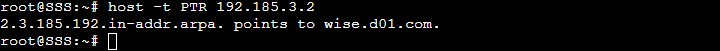


### Soal 5

> Agar dapat tetap dihubungi jika server WISE bermasalah, buatlah juga Berlint sebagai DNS Slave untuk domain utama.

**Server WISE**
Melakukan konfigurasi pada file <code>/etc/bind/named.conf.local</code> sebagai berikut untuk melakukan konfigurasi DNS Slave yang mengarah ke Berlint:

```
zone "wise.d01.com" {
        type master;
        notify yes;
        also-notify {192.185.2.3;}; //Masukan IP Berlint
        allow-transfer {192.185.2.3;}; // Masukan IP Berlint
        file "/etc/bind/wise/wise.d01.com";
};

zone "3.185.192.in-addr.arpa" {
        type master;
        file "/etc/bind/wise/3.185.192.in-addr.arpa";
};
```

Melakukan restart sevice bind9 dengan <code>service bind9 restart</code>

**Server Berlint**
Melakukan `apt-get update` dan menginstall bind9 dengan cara `apt-get install bind9 -y` dikarenakan water7 akan dijadikan DNS Slave.   
  
Lakukan konfigurasi pada file `/etc/bind/named.conf.local `  

```
zone "franky.t07.com" {
        type slave;
        masters { 10.45.2.2; }; // Masukan IP EniesLobby tanpa tanda petik
        file "/var/lib/bind/franky.t07.com";
};
```  
Melakukan restart sevice bind9 dengan `service bind9 restart`

<strong>Testing</strong>

ping wise.d01.com

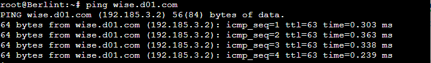  

### Soal 6

> Karena banyak informasi dari Handler, buatlah subdomain yang khusus untuk eden yaitu eden.wise.yyy.com dengan alias www.eden.wise.yyy.com yang didelegasikan dari WISE ke Berlint dengan IP menuju ke Eden dalam folder eden.

**Server WISE**  
Melakukan konfigurasi `/etc/bind/wise/wise.d01.com`  
```
$TTL    604800
@       IN      SOA     wise.d01.com. root.wise.d01.com. (
                        2021100401      ; Serial
                        604800          ; Refresh
                        86400           ; Retry
                        2419200         ; Expire
                        604800 )        ; Negative Cache TTL
;
@               IN      NS      wise.d01.com.
@               IN      A       192.185.3.2 ; IP WISE
www             IN      CNAME   wise.d01.com.
eden            IN      A       192.185.2.3 ; IP Eden
www.eden        IN      CNAME   eden.wise.d01.com.
ns1             IN      A       192.185.2.2; IP Berlint
operation       IN      NS      ns1
```  
Kemudian edit file `/etc/bind/named.conf.options` dan comment `dnssec-validation auto;` dan tambahkan baris berikut pada `/etc/bind/named.conf.options`  
```  
allow-query{any;};  
```  
Kemudian edit file `/etc/bind/named.conf.local` menjadi seperti  
```  
zone "wise.d01.com" {
        type master;
        allow-transfer {192.185.2.3;}; // Masukan IP Berlint tanpa tanda petik
        file "/etc/bind/wise/wise.d01.com";
};

zone "3.185.192.in-addr.arpa" {
        type master;
        file "/etc/bind/wise/3.185.192.in-addr.arpa";
};
```
Melakukan restart sevice bind9 dengan `service bind9 restart` 

**Server Berlint**  
Edit file `/etc/bind/named.conf.options` dan comment `dnssec-validation auto;` dan tambahkan baris berikut pada `/etc/bind/named.conf.options`

```
allow-query{any;};
```

kemudian edit file `/etc/bind/named.conf.local` untuk delegasi `eden.wise.d01.com`

```
zone "wise.d01.com" {
    type slave;
    masters {192.185.3.2;}; // Masukan IP WISE
    file "/var/lib/bind/wise.d01.com";
};

zone "eden.wise.d01.com"{
        type master;
        file "/etc/bind/operation/operation.wise.d01.com";
};
```

buat sebuah direktori `mkdir /etc/bind/wise` dan Lakukan konfigurasi pada file `/etc/bind/wise/eden.wise.d01.com`

```
$TTL    604800
@       IN      SOA     eden.wise.d01.com. root.eden.wise.d01.com. (
                        2021100401      ; Serial
                        604800          ; Refresh
                        86400           ; Retry
                        2419200         ; Expire
                        604800 )        ; Negative Cache TTL
;
@               IN      NS      operation.wise.d01.com.
@               IN      A       192.185.2.3       ;IP Eden
www             IN      CNAME   operation.wise.d01.com.
```

Melakukan restart sevice bind9 dengan `service bind9 restart`

<strong>Testing</strong>

ping operation.wise.d01.com

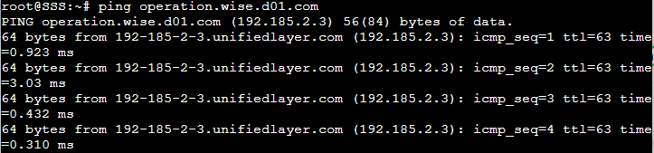

ping www.operation.wise.d01.com.png

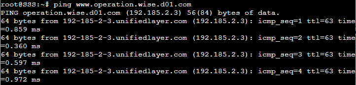

### Soal 7

> Untuk informasi yang lebih spesifik mengenai Operation Strix, buatlah subdomain melalui Berlint dengan akses strix.operation.wise.yyy.com dengan alias www.strix.operation.wise.yyy.com yang mengarah ke Eden

**Server Berlint**  
Konfigurasi file `/etc/bind/wise/eden.wise.d01.com` dengan

```
$TTL    604800
@       IN      SOA     eden.wise.d01.com. root.eden.wise.d01.com. (
                        2021100401      ; Serial
                        604800         ; Refresh
                        86400         ; Retry
                        2419200         ; Expire
                        604800 )       ; Negative Cache TTL
;
@               IN      NS      operation.wise.d01.com.
@               IN      A       192.185.2.3       ;IP Eden
www             IN      CNAME   operation.wise.d01.com.
strix           IN      A       192.185.2.3       ;IP Eden
www.strix       IN      CNAME   strix.operation.wise.d01.com.
```

Melakukan restart sevice bind9 dengan `service bind9 restart`

<strong>Testing</strong>

host -t A strix.operation.wise.d01.com.png

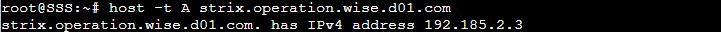

ping www.operation.wise.d01.com.png


### Soal 8

> Setelah melakukan konfigurasi server, maka dilakukan konfigurasi Webserver. Pertama dengan webserver www.wise.yyy.com. Pertama, Loid membutuhkan webserver dengan DocumentRoot pada /var/www/wise.yyy.com.

**Client SSS**  
Melakukan `apt-get update` dan menginstall lynx dengan cara

```
apt-get update
apt-get install lynx -y
```

**Server Eden**  
Melakukan instalasi Apache, PHP, OpenSSL untuk melakukan download ke website https dengan cara
```
apt-get install apache2 -y
apt-get install libapache2-mod-php7.0 -y
service apache2 start

apt-get install wget -y
apt-get install unzip -y
apt-get install php -y

apt-get install ca-certificates openssl -y
```

Pull .zip yang sudah di-push ke repo dan extract

```
wget 'https://github.com/Chroax/Jarkom-Modul-2-B11-2022/raw/main/resources/wise.zip'
unzip wise.zip
rm wise.zip

wget 'https://github.com/Chroax/Jarkom-Modul-2-B11-2022/raw/main/resources/strix.operation.wise.zip'
unzip strix.operation.wise.zip
rm strix.operation.wise.zip

wget 'https://github.com/Chroax/Jarkom-Modul-2-B11-2022/raw/main/resources/eden.wise.zip'
unzip eden.wise.zip
rm eden.wise.zip
```

Konfigurasi `/etc/bind/wise/wise.b11.com`.

```
$TTL    604800
@       IN      SOA     eden.wise.d01.com. root.eden.wise.d01.com. (
                        2021100401      ; Serial
                        604800         ; Refresh
                        86400         ; Retry
                        2419200         ; Expire
                        604800 )       ; Negative Cache TTL
;
@               IN      NS      operation.wise.d01.com.
@               IN      A       192.185.2.3       ;IP Eden
www             IN      CNAME   operation.wise.d01.com.
strix           IN      A       192.185.2.3       ;IP Eden
www.strix       IN      CNAME   strix.operation.wise.d01.com.
ns1             IN      A       192.185.2.2       ; IP Berlint
operation       IN      NS      ns1
```

Konfigurasi file `/etc/apache2/sites-available/wise.d01.com.conf`.

```
<VirtualHost *:80>

        ServerAdmin webmaster@localhost
        DocumentRoot /var/www/wise.d01.com
        ServerName wise.d01.com
        ServerAlias www.wise.d01.com

        ErrorLog \${APACHE_LOG_DIR}/error.log
        CustomLog \${APACHE_LOG_DIR}/access.log combined
</VirtualHost>
```

Lalu lakukan membaut sebuah direkroti root untuk server wise.d01.com dan melakukan copy file content

```
a2ensite wise.d01.com

mkdir /var/www/wise.d01.com

cp -RT /var/www/wise /var/www/wise.d01.com

service apache2 restart
```

<strong>Testing</strong>

lynx wise.d01.com.png


### Soal 9

> Setelah itu, Loid juga membutuhkan agar url www.wise.yyy.com/index.php/home dapat menjadi menjadi www.wise.yyy.com/home

**Server Eden**  
konfigurasi file `/var/www/wise.d01.com/.htaccess` dengan

```
a2enmod rewrite
service apache2 restart
echo "
RewriteEngine On
RewriteCond %{REQUEST_FILENAME} !-f
RewriteCond %{REQUEST_FILENAME} !-d
RewriteRule (.*) /index.php/\$1 [L]
```

Inti dari konfigurasi tersebut adalah kita melakukan cek apakah request tersebut adalah ke file atau bukan dan ke direktori atau bukan jika hal tersebut terpenuhi aka kita membuat rule untuk melakukan direct ke /index.php/home. $1 merupakan parameter yang diinputkan di url
konfigurasi file `/etc/apache2/sites-available/wise.d01.com.conf` dengan

```
<VirtualHost *:80>
        ServerAdmin webmaster@localhost
        DocumentRoot /var/www/wise.d01.com
        ServerName wise.d01.com
        ServerAlias www.wise.d01.com

        ErrorLog \${APACHE_LOG_DIR}/error.log
        CustomLog \${APACHE_LOG_DIR}/access.log combined

        <Directory /var/www/wise.d01.com>
                Options +FollowSymLinks -Multiviews
                AllowOverride All
        </Directory>
</VirtualHost>
```

Melakukan restart service apache2 dengan `service apache2 restart`

<strong>Testing</strong>

lynx wise.d01.com

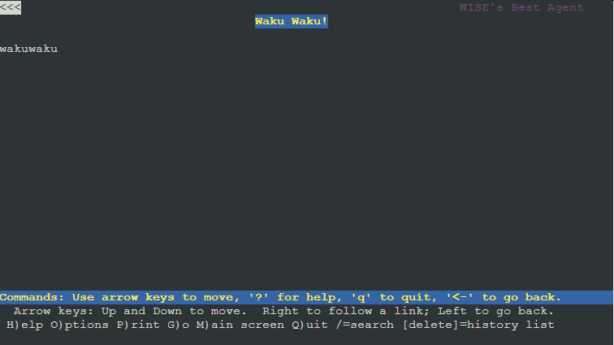

## Soal 10

> Setelah itu, pada subdomain www.eden.wise.yyy.com, Loid membutuhkan penyimpanan aset yang memiliki DocumentRoot pada /var/www/eden.wise.yyy.com


**Server Eden**  
konfigurasi file `/etc/apache2/sites-available/eden.wise.d01.com.conf` dengan

```
<VirtualHost *:80>

        ServerAdmin webmaster@localhost
        DocumentRoot /var/www/eden.wise.d01.com
        ServerName eden.wise.d01.com
        ServerAlias www.eden.wise.d01.com

        ErrorLog \${APACHE_LOG_DIR}/error.log
        CustomLog \${APACHE_LOG_DIR}/access.log combined

        <Directory /var/www/wise.d01.com>
                Options +FollowSymLinks -Multiviews
                AllowOverride All
        </Directory>
</VirtualHost>
```

Lalu aktifkan virtualhost dengan a2ensite, membuat direktori untuk documentroot di /var/www/eden.wise.d01.com dan jangan lupa untuk melakukan copy content ke documentroot dengan cara

```
a2ensite eden.wise.d01.com
mkdir /var/www/eden.wise.d01.com
cp -r /root/Praktikum-Modul-2-Jarkom/eden.wise/. /var/www/eden.wise.d01.com
service apache2 restart
```

konfigurasi file `/var/www/eden.wise.d01.com/index.php` dengan `echo "<?php echo 'yes nomor 10' ?>"`

<strong>Testing</strong>

lynx www.eden.wise.d01.com.png


## Soal 11

> Akan tetapi, pada folder /public, Loid ingin hanya dapat melakukan directory listing saja.

**Server Eden**  
konfigurasi file `/etc/apache2/sites-available/eden.wise.d01.com.conf` menamahkan Options +Indexes ke direktori yang ingin di directory list dengan

```

<VirtualHost *:80>

        ServerAdmin webmaster@localhost
        DocumentRoot /var/www/eden.wise.d01.com
        ServerName eden.wise.d01.com
        ServerAlias www.eden.wise.d01.com

        <Directory /var/www/eden.wise.d01.com/public>
                Options +Indexes
        </Directory>

        ErrorLog \${APACHE_LOG_DIR}/error.log
        CustomLog \${APACHE_LOG_DIR}/access.log combined

        <Directory /var/www/wise.d01.com>
                Options +FollowSymLinks -Multiviews
                AllowOverride All
        </Directory>
</VirtualHost>

```

Melakukan restart service apache2 dengan `service apache2 restart`

<strong>Testing</strong>

lynx www.eden.wise.d01.com.png

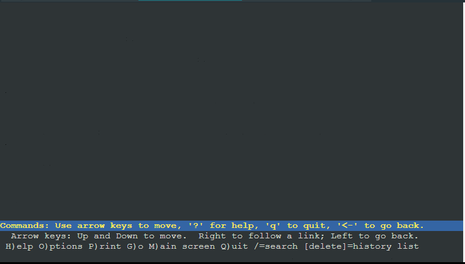

## soal 12

> Tidak hanya itu, Loid juga ingin menyiapkan error file 404.html pada folder /error untuk mengganti error kode pada apache.

**Server Eden**  
konfigurasi file `/etc/apache2/sites-available/eden.wise.d01.com.conf` menambahkan konfigurasi ErrorDocumentuntuk setiap error yang ada yang diarahkan ke file /error/404.html dengan

```

<VirtualHost *:80>
        ServerAdmin webmaster@localhost
        DocumentRoot /var/www/eden.wise.d01.com
        ServerName eden.wise.d01.com
        ServerAlias www.eden.wise.d01.com

        ErrorDocument 404 /error/404.html
        ErrorDocument 500 /error/404.html
        ErrorDocument 502 /error/404.html
        ErrorDocument 503 /error/404.html
        ErrorDocument 504 /error/404.html

        <Directory /var/www/eden.wise.d01.com/public>
                Options +Indexes
        </Directory>

        ErrorLog \${APACHE_LOG_DIR}/error.log
        CustomLog \${APACHE_LOG_DIR}/access.log combined

        <Directory /var/www/wise.d01.com>
                Options +FollowSymLinks -Multiviews
                AllowOverride All
        </Directory>
</VirtualHost>

```

Melakukan restart service apache2 dengan `service apache2 restart`

<strong>Testing</strong>

lynx www.eden.wise.d01.com.png

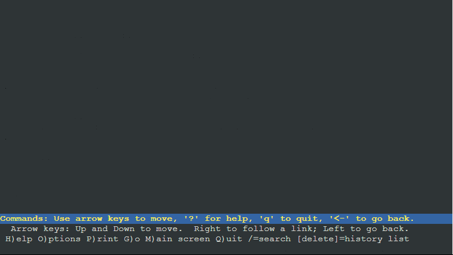

## Soal 13

> Loid juga meminta Franky untuk dibuatkan konfigurasi virtual host. Virtual host ini bertujuan untuk dapat mengakses file asset www.eden.wise.yyy.com/public/js menjadi www.eden.wise.yyy.com/js

## Soal 14

> Loid meminta agar www.strix.operation.wise.yyy.com hanya bisa diakses dengan port 15000 dan port 15500.

## Soal 15

> dengan autentikasi username Twilight dan password opStrix dan file di /var/www/strix.operation.wise.yyy.

## Soal 16

> dan setiap kali mengakses IP Eden akan dialihkan secara otomatis ke www.wise.yyy.com.

## Soal 17

> Karena website www.eden.wise.yyy.com semakin banyak pengunjung dan banyak modifikasi sehingga banyak gambar-gambar yang random, maka Loid ingin mengubah request gambar yang memiliki substring “eden” akan diarahkan menuju eden.png. Bantulah Agent Twilight dan Organisasi WISE menjaga perdamaian!

